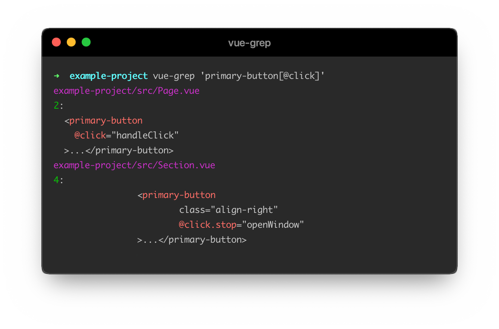

<div align="center">
  <br>
  
</div>

<div align="center">
  <em>Grep your Vue.js codebase with CSS selectors</em>
  <br>

  <a href="https://npm.im/vue-grep"></a>
  <a href="https://packagephobia.now.sh/result?p=vue-grep"></a>
</div>

Have you ever wanted to [grep](https://phoenixnap.com/kb/grep-command-linux-unix-examples) your Vue.js codebase for something specific, like a combination of tags and attributes? Only to realize that you can't because attributes can span multiple lines and be in arbitrary order.

**vue-grep** is a command-line tool that lets you search your Vue.js codebase using CSS selector syntax (like [`querySelectorAll`](https://developer.mozilla.org/en-US/docs/Web/API/Document_object_model/Locating_DOM_elements_using_selectors) or jQuery) — essential for navigating large codebases! 🔥

<div align="center">
  
</div>

<sub>If you like this project, please star it & [follow me](https://github.com/privatenumber) to see what other cool projects I'm working on! ❤️</sub>

## 🚀 Install
```sh
$ npm i -g vue-grep
```

Alternatively, use [npx](https://nodejs.dev/learn/the-npx-nodejs-package-runner) to run it without installation:
```
$ npx vue-grep
```

## 👨‍🏫 Usage

```sh
$ vue-grep <query> [path/glob ...]
```

#### Tips

- _Recommended to pass the query in with single-quotes to prevent [accidental interpolation](https://stackoverflow.com/a/6697781)_

	eg. `$ vue-grep '[v-bind="$attrs"]'`

- _If passing in a glob, specify the `.vue` extension. (eg. `**/*.vue`)_

### Options
#### -l, --files-with-matches
Only print the paths with at least one match.
#### -s, --show-children
Show the children of matching elements. Defaults to being collapsed.

#### --exclude-directory
Directory names to exclude on non-glob searches. (Default: `node_modules`, `vendor`, `public`, `dist`)

#### --hidden
Search hidden files and directories.

## 🌟 Query features
### Standard selectors
- [`tag-name`](https://developer.mozilla.org/en-US/docs/Web/CSS/Type_selectors) - Type selector
- [`.class-name`](https://developer.mozilla.org/en-US/docs/Web/CSS/Class_selectors) - Class selector
- [`#identifier`](https://developer.mozilla.org/en-US/docs/Web/CSS/ID_selectors) - ID selector
- [Attribute selector](https://developer.mozilla.org/en-US/docs/Web/CSS/Attribute_selectors)
  - `[attribute-name]` - Existence
  - `[attribute-name="value"]`/`[attribute-name!="value"]` - Equality
  - `[attribute-name=/pattern/]`/`[attribute-name!=/pattern/]` - Regular expression matching

- Pseudo-classes
  - [`:empty`](https://developer.mozilla.org/en-US/docs/Web/CSS/:empty) - Elements with no children
  - [`:first-child`](https://developer.mozilla.org/en-US/docs/Web/CSS/:first-child) - First child amongst siblings
  - [`:last-child`](https://developer.mozilla.org/en-US/docs/Web/CSS/:last-child) - Last child amongst siblings
  - [`:nth-child(n)`](https://developer.mozilla.org/en-US/docs/Web/CSS/:nth-child) - _n_ th child amongst siblings
  - [`:nth-last-child(n)`](https://developer.mozilla.org/en-US/docs/Web/CSS/:nth-last-child) - _n_ th child from bottom amongst siblings
  - [`:not(query)`](https://developer.mozilla.org/en-US/docs/Web/CSS/:not) - Query negation

- Combinators
  - [`parent child`](https://developer.mozilla.org/en-US/docs/Web/CSS/Descendant_combinator) - Descendant
  - [`parent > immediate-child`](https://developer.mozilla.org/en-US/docs/Web/CSS/Child_combinator) - Immediate child
  - [`element ~ general-sibling`](https://developer.mozilla.org/en-US/docs/Web/CSS/General_sibling_combinator) - General sibling
  - [`element + adjacent-sibling`](https://developer.mozilla.org/en-US/docs/Web/CSS/Adjacent_sibling_combinator) - Adjacent sibling

### Non-standard selectors
- Directive selector
  - `[v-directive]` - Existence
  - `[v-directive:argument]` - Existence with argument
  - `[v-directive:argument.modifier]` - Existence with argument and modifier
  - `[v-directive="value"]`/`[v-directive!="value"]` - Equality
  - `[v-directive=/pattern/]`/`[v-directive!=/pattern/]` - Regular expression matching
  - Directive shorthands
    - `[:prop]`/`[:prop="value"]`/`[:prop=/pattern/]` - Prop
    - `[@event]`/`[@event="value"]`/`[@event=/pattern/]` - Event-listener
    - `[#slot]`/`[#slot="value"]`/`[#slot=/pattern/]` - Slot
- Pseudo-classes
	- `:contains("text")` - Element that contains string
	- `:contains(/pattern/)` - Element that contains string that matches regular expression

## ⚡️ Example queries
All examples are searching the current working directory.

#### Find elements with class `button` and `primary`
```sh
$ vue-grep '.button.primary'
```

The class selector can parse and test against dynamic classes aslong as it's simple (eg. no run-time evaluations). For matching complex class directives, consider using regular expression matching.

#### Find `button` elements with the `@click.stop` listener
```sh
$ vue-grep 'button[@click.stop]'
```

#### Find radio `input` elements with a `disabled` prop
```sh
$ vue-grep 'input[type="radio"][:disabled]'
```

#### Find `div` elements with `v-if`
```sh
$ vue-grep 'div[v-if]'
```

#### Find empty elements
```sh
$ vue-grep ':empty'
```

#### Find elements that contain strings that match regular expression `/hello world/`
```sh
$ vue-grep ':contains(/hello world/)'
```

### Don't see your favorite use-cases?
[Add it in](https://github.com/privatenumber/vue-grep/edit/develop/README.md)! We'd love to see how you're using it.

## 🙋‍♀️ Need help?
If you have a question about usage, [ask on Discussions](https://github.com/privatenumber/vue-grep/discussions).

If you'd like to make a feature request or file a bug report, [open an Issue](https://github.com/privatenumber/vue-grep/issues).
